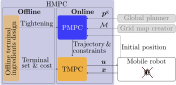
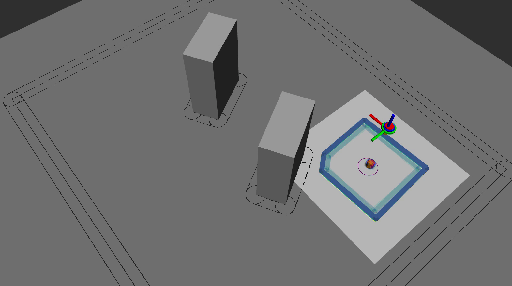

# hmpc

[](https://opensource.org/licenses/MIT)
[](https://arxiv.org/abs/2406.11506)


## Submission
A reference implementation of the embedded MPC framework used in our submission [Embedded Hierarchical MPC for Autonomous Navigation](https://arxiv.org/abs/2406.11506).\
Paper: https://arxiv.org/pdf/2406.11506. \
Video: https://youtu.be/0RnrKk6830I.

```bibtex
@article{benders2024embedded,
    title   = {Embedded Hierarchical MPC for Autonomous Navigation},
    author  = {Benders, Dennis and K{\"o}hler, Johannes and Niesten, Thijs and Babu{\v{s}}ka, Robert and Alonso-Mora, Javier and Ferranti, Laura},
    journal = {arXiv preprint arXiv:2406.11506},
    year    = {2024}
}
```


## Summary
In this work, we propose a *hierarchical MPC (HMPC) framework* including the co-design of a planning MPC (PMPC) and tracking MPC (TMPC). The system diagram is given below:

<div align="center">
  
</div>

In the offline phase, the terminal ingredients of the TMPC are computed. These ingredients implicitly encode the TMPC capabilities and include the terminal cost matrix $P$, terminal control matrix $K$, and positive constants $c_j^\mathrm{s}, j \in \mathbb{N}_{[1,n^\mathrm{s}]}$ and $c^\mathrm{o}$ to tighten the system and obstacle avoidance constraints, respectively. Based on a user-chosen minimum distance between trajectory and obstacles, the terminal set scaling $\alpha$ can be computed.

During online operation, the PMPC plans a dynamically feasible trajectory based on goal position $\boldsymbol{p}^\mathrm{g}$ and grid map $\mathcal{M}$. To construct this plan such that the TMPC is guaranteed to track it and take the TMPC capabilities into account, the system constraints are tightened by $c_j^\mathrm{s} \alpha, j \in \mathbb{N}_{[1,n^\mathrm{s}]}$ and the obstacle avoidance constraints are tightened by $c^\mathrm{o} \alpha$. The planned trajectory is tracked by the TMPC using state state feedback $\boldsymbol{x}$. The PMPC and TMPC use the same nonlinear model but operate at different frequencies, thus enabling the real-time implementation of the scheme using off-the-shelf nonlinear solvers on an onboard computer with limited computational resources.

:rocket: HMPC has several advantages over a comparable single-layer MPC (SMPC) formulation that performs both planning and tracking in a single layer:
- HMPC allows to increase the prediction horizon by a minimum factor of 5, resulting in improved planning performance. In the case of our work, this results in a smoother trajectory and faster convergence to the goal position.
- HMPC allows to decouple the planning and tracking tasks, resulting in less sensitivity to model mismatch and better ability to maintain altitude.
- In contrast to SMPC, HMPC allows to prove obstacle avoidance and recursive feasibility of the complete framework. These are important properties to consider for safety-critical robotic applications.

:sparkles: To avoid the obstacles, the PMPC and SMPC schemes leverage a novel and efficient obstacle avoidance constraint design method called *I-DecompUtil*. *I-DecompUtil* applies the *DecompUtil* convex decomposition algorithm applied per straight line segment between optimal PMPC states to construct convex obstacle-free regions per stage in the horizon.

The animation below shows the HMPC framework operating in the lab:

<div align="center">
  
</div>

The quadrotor platform used for the lab experiments is based on the [NXP HoverGames development kit](https://nxp.gitbook.io/hovergames):

<div align="center">
  
</div>


## How to get started?
**Interested in reproducing our results and extending them for your own work? No problem!**

This repository contains the code and documentation to reproduce the simple simulation, Gazebo simulation, and lab experiment results presented in our [paper](https://arxiv.org/pdf/2406.11506). This includes the modular MPC code framework used to implement all MPC schemes (PMPC, TMPC, and SMPC) and the *I-DecompUtil* obstacle avoidance constraints design method.

To get started, clone this repository by running:
```bash
git clone --recurse-submodules git@github.com:dbenders1/hmpc.git
```
and follow the instructions in the [src README](./src/README.md).


## Contact information
Do you want to collaborate or do you have any questions? Feel free to reach out via https://github.com/dbenders1!
